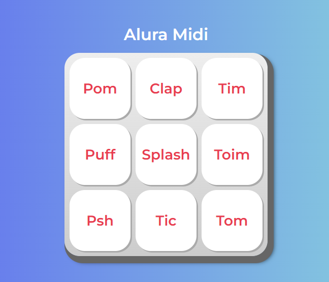

# 🎹 Alura Midi

Un teclado virtual interactivo para la web que reproduce sonidos al presionar sus teclas. Construido con **HTML**, **CSS** y **JavaScript**.

---

## 🎯 ¿Qué es Alura Midi?

**Alura MIDI** es un proyecto interactivo que simula un instrumento musical digital directamente en tu navegador.  
Consiste en un teclado virtual con botones que, al ser pulsados (ya sea con un clic del ratón o desde el teclado), reproducen diferentes sonidos.

> Ideal para aprender y practicar desarrollo web dinámico con JavaScript.

---

## ⚙️ Tecnologías utilizadas

- 🧱 **HTML**: Estructura base del teclado y elementos `<audio>`.
- 🎨 **CSS**: Estilos visuales del teclado, con diseño responsivo para móviles y tabletas.
- 🧠 **JavaScript**: Gestiona la interacción, eventos y reproducción de sonidos.

---

## 🧪 ¿Cómo usarlo?

1. 📥 Clona el repositorio:

   ```bash
   git clone https://github.com/josecervera20/Alura-Midi.git
   ```

2. 🌐 Abre el archivo `index.html` en tu navegador (Chrome, Firefox, Edge, etc.).

3. 🎵 ¡Haz clic en los botones o presiona las teclas correspondientes en tu teclado para crear música!

---

## 🚀 Funcionalidades destacadas

- ✅ **Interfaz interactiva:** Teclado musical con sonidos, controlable por clic o teclado físico.
- 📱 **Diseño Adaptable:** Interfaz responsive para móviles y tabletas.
- ✨ **Código Optimizado:** JavaScript refactorizado para mayor limpieza y robustez (con `forEach`, validaciones y JSDoc).

---

## 📚 ¿Por qué este proyecto?

Este proyecto se desarrolló como parte del curso:

> **JavaScript para Web: Crea páginas dinámicas**  
> 💻 Alura Latam

Su propósito es educativo y práctico, ofreciendo una excelente base para:

- 🧩 Comprender la integración entre HTML, CSS y JS.
- 🛠️ Aplicar buenas prácticas de desarrollo.
- 📱 Aprender diseño adaptativo y estructuras accesibles.

---

## 🙌 Agradecimientos

Este proyecto fue posible gracias a los conocimientos adquiridos en el curso de Alura Latam.

👩‍🏫 Gracias a la instructora **Jeanmarie Quijada**, por su dedicación y excelente enseñanza.

---

### 💻 Vista Previa del Proyecto

[](images/alura-midi-screenshot.png)

---

## 📄 Licencia

Este proyecto es de código abierto y se publica bajo la [Licencia MIT](LICENSE). Siéntete libre de usar, modificar y distribuir este código para tus propios proyectos.

¡Explora, aprende y diviértete creando música con JavaScript! 🎶
